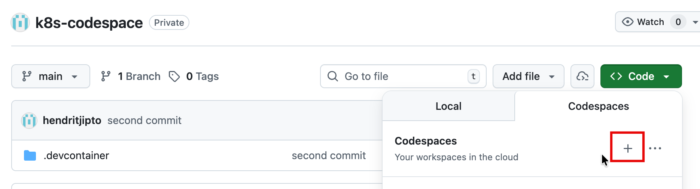
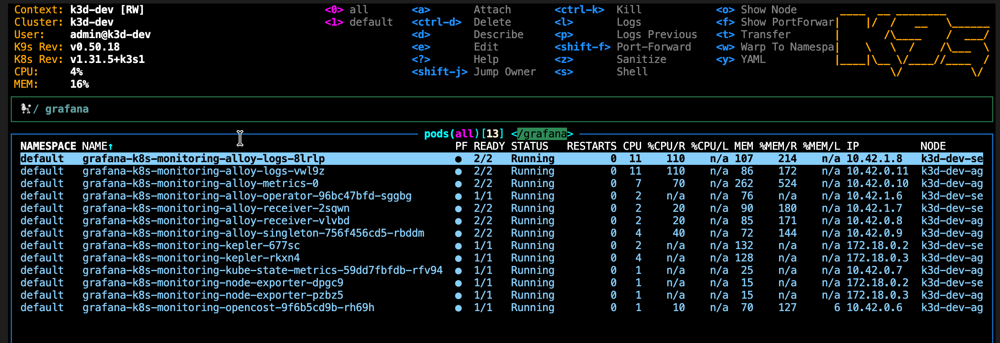

# 👾 K8s Codespace

> Quickly spin up a Kubernetes cluster in a GitHub Codespace and deploy applications with Grafana Cloud monitoring.

---

## Prerequisites

| Tool | Included in Codespace |
|------|:---------------------:|
| k3d  | Yes |
| kubectl | Yes |
| Helm | Yes |
| k9s  | Yes |

---

## 1. Create the Kubernetes Cluster

1. Launch a Codespace from this repository:

   

2. Open the terminal and create a cluster:

   ```shell
   k3d cluster create k8s1 --servers 1 --agents 1 -p "8080:3000@loadbalancer"
   ```

3. Verify the cluster is running:

   ```shell
   kubectl get nodes
   kubectl get pods -A
   ```

4. *(Optional)* Browse the cluster with **k9s**:

   ```shell
   k9s
   ```

   

> [!WARNING]
> Codespace resources are limited — avoid adding multiple nodes.

---

## 2. Deploy the Application

1. **Build** the container image from the `app/` folder:

   ```shell
   docker build -t nodeapp:latest app/
   ```

2. **Import** the image into the k3d cluster:

   ```shell
   k3d image import nodeapp:latest -c k8s1
   ```

3. **Create** the production namespace:

   ```shell
   kubectl create namespace production
   ```

4. **Apply** the Kubernetes manifest:

   ```shell
   kubectl apply -f app/express-app.yaml
   ```

---

## 3. Install Grafana Cloud Monitoring

### 3.1 Configure credentials

Copy the example environment file and fill in your Grafana Cloud credentials:

```shell
cp .env.example .env
```

Edit `.env` and set **all** username / password values. See `.env.example` for the full list of required variables.

> [!IMPORTANT]
> `.env` contains secrets and is excluded from version control via `.gitignore`. **Never commit this file.**

### 3.2 Deploy with one command

```shell
./deploy-grafana.sh
```

The script will:

1. Load credentials from `.env`
2. Render `definition.yaml` from `definition.yaml.template` using `envsubst`
3. Run the Helm deployment:

   ```shell
   helm repo add grafana https://grafana.github.io/helm-charts
   helm repo update
   helm upgrade --install --rollback-on-failure --timeout 300s \
     grafana-k8s-monitoring grafana/k8s-monitoring \
     --version "^4" --namespace "grafana" --create-namespace \
     --values definition.yaml
   ```

---

## Project Structure

```
.
├── app/
│   ├── Dockerfile
│   ├── express-app.yaml
│   ├── index.js
│   └── package.json
├── helm/
│   └── definition.yaml          # legacy values (old format)
├── definition.yaml.template     # values template with env placeholders
├── definition.yaml              # rendered values (git-tracked, no secrets)
├── deploy-grafana.sh            # one-command deploy script
├── .env.example                 # env template (safe to commit)
├── .env                         # actual secrets (git-ignored)
└── readme.md
```

